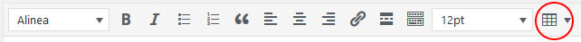

# Enable Table
An [Wordpress](https://wordpress.org/) plugin that enables table support for the TinyMCE.

## Requirements
- WordPress 4+

## Installation
- Download and unzip
- Copy the sas-enable-table folder to your wp-content/plugins/ directory
- Activate the Enable Table plugin with the plugin manager

## Update
- Overwrite the files in the sas-enable-table folder

## Usage
The table option is now available in the editor

## Changelog
### 1.0.0
- Initial release

## License
This work is licensed under a [MIT](https://opensource.org/licenses/MIT) License.